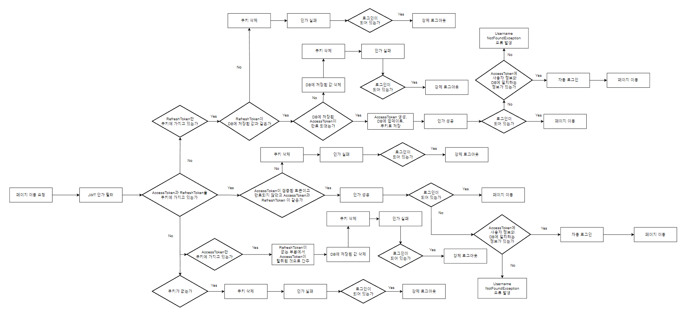

# TMDB API를 활용한 영화, TV프로그램 검색 사이트

## [사이트 링크](https://eunhop.site)

---


---

## • 프로젝트 내용 :

- 아무 권한 없이 영화 검색, 영화상세정보, 공지사항 확인 가능합니다.
- 유저 권한으로 로그인 할 경우 검색한 영화 찜하기와 찜한 영화들의 목록도 볼 수 있고
- 영화 상세정보에서 한줄평도 남길 수 있습니다.
- 어드민 권한으로 로그인 할 경우 유저 관리(한줄평 못쓰게 막기)와 공지사항 글쓰기 가능, 악의적인 한줄평 숨김처리를 할 수 있습니다.

---

## • 기술 스택

### 백엔드

    Language : Java 17

    Framework : Spring Boot 3.1.4

    IDE : IntelliJ IDEA 2023.2 (Ultimate Edition)

    Build Tools : gradle-8.2.1

### Library :

    Spring Data JPA, Spring Validation, DB = MariaDB

    Spring Security, Spring OAuth2 Client, jjwt-api, jjwt-impl, jjwt-jackson

    Spring Boot Web, Spring WebFlux,

    Spring devtools, Lombok

### 프론트엔드

    spring-boot-starter-thymeleaf, thymeleaf-extras-springsecurity6,

    javascript, ajax, jquery

---

## 데이터베이스 E-R 다이어그램


---

## • 페이지 순서도


---

## • AWS 순서도


---

## Spring Security로 보안 구현하기

### JWT

JWT(Json Web Token)는 **토큰 기반 인증방식으로 인증에 필요한 정보들을 Token 에 담아
암호화시켜 쿠키**에 담아 사용합니다.

쿠키는 **XSS(Cross Site Scripting) 공격, 패킷을 감청, CSRF(Cross-Site Request Forgery) 공격으로 탈취**될 수

있습니다.

따라서 해당 공격을 예방하기 위해 쿠키를 생성할 때 **httpOnly, secure, sameSite="Lax" 옵션을
지정**해줬습니다.

---

#### 로그인 인증 과정


---

#### JWT 인가 과정



복잡해보이지만 **AccessToken 과 RefreshToken** 을 사용해서 **페이지 이동시 상황에 따라 처리한 로직**입니다.

---

## OAuth 2.0 으로 간편 로그인 구현


---

## TMDB API 데이터 가져와서 활용하기

### WebClient

스프링에서는 **REST API 를 호출해 간편하게 바로 객체에 담을 수 있는** RestTemplate 가 있습니다.

근데 **스프링 5부터 deprecated** 된다는 얘기가 있었고 **현재는 maintenance mode** 라고 합니다.

maintenance 이기 때문에 RestTemplate 로 사용해도 되지만 미래에 또 쓰게 될 때를 대비해

RestTemplate 의 상위 호환 모듈인 **WebClient 를 써보기로 결정**했습니다.

WebClient 를 쓰기 위해서 **Spring WebFlux** dependency 를 추가해 줬습니다.

---

## 개발하면서 기억에 남은 문제 

### 뒤로가기
#### 오류 페이징 과정


#### 원했던 페이징 과정


작품 상세정보 페이지에서 한줄평 또는 즐겨찾기 과정을 **수행한 후에 새로고침이 되면서
뷰단에 DB 데이터와 동기화**가 됩니다.

하지만 제 생각과는 다르게 **새로고침이 페이지 히스토리에 남으면서 뒤로가기 버튼을
누르면 같은 페이지가 반복되어 버리는 문제**가 발생했습니다.

해당 문제를 해결하기 위해서 **자바스크립트의 location.replace(location.href) 메소드**를

사용하면 **페이지 히스토리에 남기지 않는다**는 것을 찾았습니다.

그래서 **자바스크립트로 서버와 통신하기 위해서 ajax 를 도입**하기로 했습니다.

ajax 는 **자바스크립트에서 서버로 데이터를 넘겨줘서 로직이 진행 후 성공적이면 location.replace(location.href) 메소드가 실행**됩니다.

### EC2 환경변수 설정

EC2에서 환경변수 처리를 어떻게 하는지 몰라 엄청 헤메다가 해결했습니다.

우분투 환경에서 환경변수는 ~/etc/profile 에 넣어주면 됩니다.
맨 밑에다가 입력해주면 됩니다.

    export 환경변수=값
    ex) export PASSWORD=pswd1234

환경변수가 많다보니 다 직접 타이핑하고 있었는데 윈도우에서 복사해서 PuTTY 에다 마우스 우클릭하니까 복사가 되는게 신기했습니다.

profile을 저장하고 나와서 환경변수 영구적용 해줍니다.

    source /etc/profile

마지막으로 echo 명령으로 환경변수가 들어갔는지 확인합니다.

    echo $환경변수명
    ex) echo $PASSWORD

드디어 application.yaml 에 있는 ${ } 처리한 환경변수들을 사용할 수 있게 됐습니다.

    ex) spring:
            datasource:
                url: jdbc:mariadb://${DB_URL}:${DB_PORT}/${DB_NAME}?useUnicode=true&characterEncoding=utf8

### EC2+RDS 배포하며 생긴 리다이렉션 문제

OAuth2에서 **https 를 redirect 해야 하는데** 서버 어딘가에서 꼬였는지

**http 를 redirect** 해서 **카카오 와 구글 OAuth 2.0의 redirect_url 이 안맞는 문제**가 생겼습니다.

몇시간 삽질한 결과 **application.yaml 에 코드 추가**해주는걸로 다행히 해결했습니다 ㅠㅠ

```yml
server:
forward-headers-strategy: FRAMEWORK
```

---

## 프로젝트의 특징 및 느낀점

제 프로젝트는 **모바일 환경까지 구현**하였습니다.

배포까지 되어있어 **언제 어디서든 접근이 가능**합니다.

제 첫 프로젝트로서 **하나부터 열까지 모든걸 구현해보며 공부**하는 시간을 가질 수 있었습니다.

개발하면서 **문제에 직면했을 때 해결하는 능력**을 많이 갖추게 되었습니다.

예를들어 위에서 다룬 페이지 히스토리가 계속 쌓여 뒤로가기가 안먹히는 문제에서

**어떤 기술을 써야 하는지**, **해당 기술을 쓰기위해 나에게 필요한 부분이 어디이고
어떤 부분을 활용해야하는지**에 대한 효율적인 정보 검색을 통해서 **이전보다 더 빠르게
문제를 해결**할 수 있었습니다.

---

## 기대가치

사이트를 **배포**해놨기 때문에 **언제 어디서나** 모바일 환경이든 pc 환경이든 **인터넷만 된다면**

사이트에 **접속**할 수 있습니다.

**현재 어떤 작품이 인기가 있는지 알아보고 작품을 검색 하는데에 사용**할 것 같습니다.

관심목록도 활용하면서 개인 영화 평가 리스트같은 느낌으로 활용해도 괜찮을 것 같습니다.

페이지에서 남들과 다른 차별점을 느끼기는 힘들지만 **제 역량을 키워준 프로젝트**로서

저한테는 큰 가치를 가질수 밖에 없는 것 같습니다.

---

### 아쉬운 점

- 실행하면서 다 확인해봤기에 치명적인 오류는 없지만 테스트 코드를 짜는 법을  공부해 개발 시간을 단축하는 것이 좋을 것 같습니다.
- 클린 코드나 디자인 패턴에 대한 생각을 못해서 너무 뒤죽박죽인 것 같습니다.
이번 프로젝트를 계기로 다음엔 더 확실하게 계획하고 구현해보고 싶습니다.
